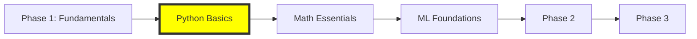

# AI Learning 🚀

A structured learning path to artificial intelligence development.

## 📍 Current Status

### You Are Here

**Currently working on:** Python Basics  
**Next up:** Booleans and Operators

## Learning Path & Progress

### Phase 1: Fundamentals 📚

#### 1. Python Basics

- [x] Project setup and environment
- [x] Core Python Concepts
  - [x] Variables et nombres (int, float)
  - [x] Chaînes de caractères (strings)
  - [x] Booléens et opérateurs logiques
  - [x] Control flow (if/else, loops)
  - [x] Functions and parameters
- [x] Data Structures
  - [x] Lists and tuples
  - [x] Dictionaries and sets
  - [x] List comprehensions
- [x] Advanced Python
  - [x] Object-oriented programming
  - [x] Modules and packages
  - [x] Error handling
  - [x] File I/O
- [ ] Python Best Practices
  - [ ] PEP 8 style guide
  - [ ] Virtual environments
  - [ ] Testing basics
  - [ ] Documentation

#### 2. Mathematical Essentials

- [ ] Linear Algebra
- [ ] Calculus
- [ ] Statistics

#### 3. Machine Learning Foundations

- [ ] Core concepts
- [ ] Types of learning
- [ ] Model evaluation
- [ ] Learning theory basics

### Phase 2: First Steps 🌱

- [ ] Data Manipulation (NumPy, Pandas)
- [ ] Visualization (Matplotlib, Seaborn)
- [ ] Basic Models
- [ ] PyTorch Introduction

### Phase 3: Neural Networks 🧠

- [ ] Neural Network Architectures
- [ ] Training Deep Networks
- [ ] Advanced Topics
- [ ] Projects

## Latest Updates

| Date       | Module | Topic                  | Status |
| ---------- | ------ | ---------------------- | ------ |
| 2024-11-06 | Python | Variables and numbers  | ✅     |
| 2024-11-06 | Python | Strings                | ✅     |
| Next       | Python | Booleans and operators | 🔜     |

Legend: ✅ Complete | 🟡 In Progress | 🔜 Next Up | ⬜ Not Started

## Prerequisites

- Basic programming knowledge
- Git basics
- Command line familiarity

## Getting Started

1. Clone this repository
2. Follow the setup instructions in `phase-1-fundamentals/1-python-basics/setup.md`
3. Start with the current module's README

## Resources

### Official Documentation

- [Python Documentation](https://docs.python.org/3/)
- [PyTorch Documentation](https://pytorch.org/docs/)
- [NumPy Documentation](https://numpy.org/doc/)

### Additional Learning Materials

- Links to recommended books
- Useful tutorials
- Community resources

## Contributing

Feel free to suggest improvements or corrections via issues or pull requests.

## License

This project is licensed under the MIT License - see the LICENSE file for details.

---

Created with 💜 by Thibault and Claude
